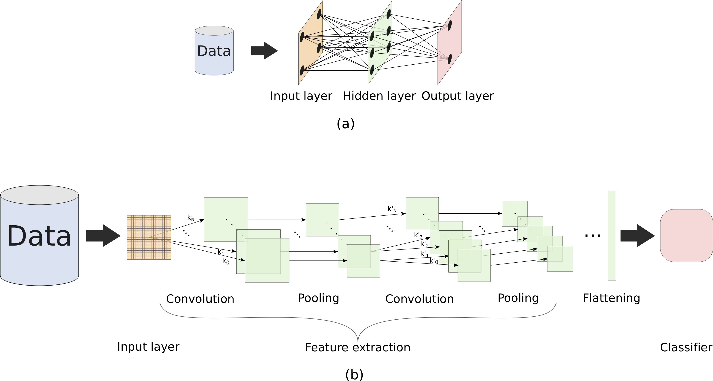

#Deep Learning Tutorial

This tutorial is part of the didactic text: Learning Deep Learning (CDT-15): (link)

The purpose of this tutorial is to provide simple didactic examples of deep learning architectures and problem solution. The codes included here are based on toy datasets, and restricted to parameters allowing short processing time.  More sophisticated, real applications will require the parameters to be adjusted with greater care.

For all the codes presented here, we use [Keras](https://keras.io/) as the deep learning library. Keras is a useful and straightforward framework, which can be employed for simple and complex tasks.  Keras is written in the Python language, providing self-explanatory codes, with the additional advantage to being executed under [TensorFlow](https://www.tensorflow.org/) backend. 

More details are available at (link). 
